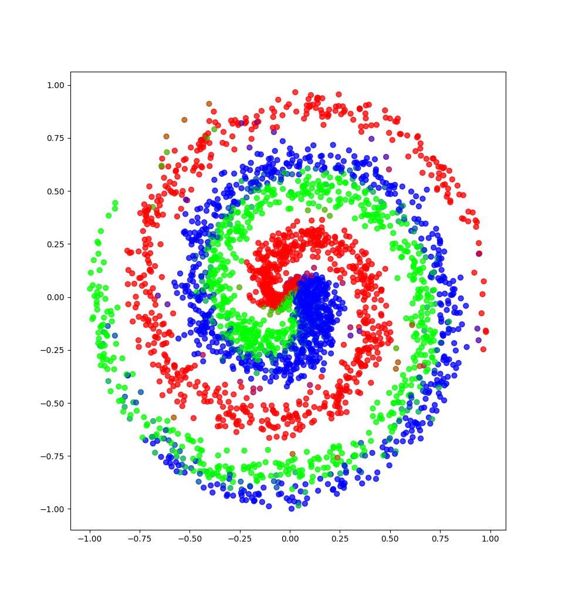

A neural network written in Python, using Numpy.

Created following the book [Neural Networks from Scratch](https://nnfs.io/)

#### Summary of the modules:
---

- Accuracy
	- Regression - compare through difference of prediction and real, taking into account a standard precision.
	- Categorial - compare accuracy classifications.
- Activation - [Info](https://en.wikipedia.org/wiki/Activation_function)
	- ReLU - Rectified Linear Unit 
	- Softmax 
	- Sigmoid 
- Layer
	- Dense layer - regular dense layer of neurons.
	- Dropout layer - [Why?](https://en.wikipedia.org/wiki/Dilution_(neural_networks))
	- Input layer
- Loss - [Info](https://en.wikipedia.org/wiki/Loss_functions_for_classification) (for regression use mean squared error)
	- Categorial Cross Entropy - cross entropy using a softmax activation. 
	- Binary Cross Entropy - cross entropy using a sigmoid activation. 
	- Mean Squared Error - the average square of all errors.
	- Mean Absolute Error - the average absolute value of all errors. 
- Optimiser - [Info](https://en.wikipedia.org/wiki/Backpropagation) - [Keras Docs](https://keras.io/api/optimizers/)
	- SGD - Stochastic Gradient Descent.
	- Adagrad - Adaptive Gradient.
	- RMSprop - Rolling Mean Squared propagation.
	- Adam - Adaptive Momentum.

**`main.py`** includes an example use of the neural network.

It classifies a scatter plot of 3 classes as so:

	

